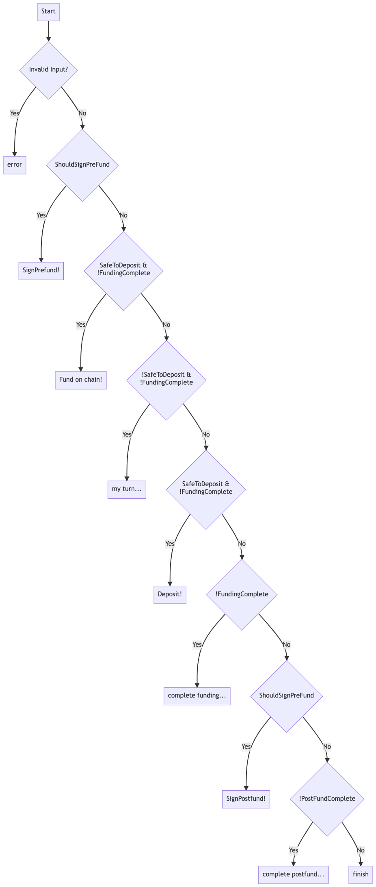

## 0001 -- Flowcharts vs Statecharts

An objective encodes a state chart (or state machine), but in a slightly non-standard manner:

- The **enumerable state** of the objective consists of several "pause points" where the current peer cannot progress without external input `X`. Hence we call theses states "Waiting For `X`".
- The **enumerable state** of the objective is not stored anywhere: it is computed from the **extended state**.
- The **extended state** of the objective (sometimes known as the "context") contains potentially infinite data such as off-chain messages, signatures and so on.
- State transitions are triggered by **events** in one of two ways:
  - new information comes to light and the extended state is **updated**
  - the objective is **cranked** -- driven towards completion -- and side effects are generated and returned. This may also update the extended state.
- The objective progress can be thought of as a flow chart (rather than a conventional state chart). When a blocking condition is identified, the state transition method call returns "early". As more progress is made, the execution reaches deeper into the method until eventually it reaches the end and the objective is complete.

Updating and cranking MUST be strictly pure functions, returning a fresh copy of the objective (not mutating its inputs).

A conventional state chart is fairly similar, but would:

- Combine the **enumerable state** and **extended state** into (simply) a "state"
- Have a state transition that switches on the current enumerable state and defers to one of a number of per-state reducers.
- Arguably struggle to deal with events arriving "out of order". One solution would be to have many "self" transitions dealing with updates to the **extended state** which do not transition the **enumerable state**.

A traditional state chart is shown on the left, and a flowchart on the right:
|State Chart | Flow Chart|
|--|--|
|||

For the flow chart, declared side effects are shown with a ! and the blocking condition / pause points are shown with a ...

## We chose the flowchart design because

- It reduces replication of state between the enumerable and extended parts
- It emphasizes that information can be absorbed independently of the enumerable state (by default, although it is possible to have a dependence on the extended state). It is simple to process **passive** transitions.
- It emphasizes that the state can **actively** transition independently of the events recieved.
- The separation betwen passive and active transitions makes restarting protocols straightforward. After all of the information is fed into the objective (in any order), a crank will get things going.

## Discarded code

The below code is an example of how we could have (indeed how we have done in the past) implemented the direct funding off chain protocol.
Firstly, some common code that is independent of the state chart / flowchart choice:

```go
package protocols

import (
	"errors"
	"math/big"

	"github.com/statechannels/go-nitro/types"
)

// A linear state machine with enumerated states.
// PreFundIncomplete => NotYetMyTurnToFund => FundingIncomplete => PostFundIncomplete => Finished
type DirectFundingEnumerableState int

const (
	WaitingForCompletePrefund DirectFundingEnumerableState = iota // 0
	WaitingForMyTurnToFund
	WaitingForCompleteFunding
	WaitingForCompletePostFund
	WaitingForNothing // Finished
)

// Effects to be declared. For now these are just strings. In future they may be more complex and type safe
type SideEffects []string

func SignPreFundEffect(cId types.Bytes32) string {
	return "sign Prefundsetup for" + cId.String()
}
func SignPostFundEffect(cId types.Bytes32) string {
	return "sign Postfundsetup for" + cId.String()
}
func FundOnChainEffect(cId types.Bytes32, asset string, amount *big.Int) string {
	return "deposit" + amount.Text(64) + "into" + cId.String()
}

var NoSideEffects = []string{}

var zero = big.NewInt(0)

type ObjectiveStatus int8

const (
	Unapproved ObjectiveStatus = iota
	Approved
	Rejected
)

// DirectFundingObjectiveState is a cache of data computed by reading from the store. It stores (potentially) infinite data
type DirectFundingObjectiveState struct {
	Status    ObjectiveStatus
	ChannelId types.Bytes32

	ParticipantIndex map[types.Address]uint // the index for each participant

	MyIndex uint // my participant index

	PreFundSigned []bool // indexed by participant. TODO should this be initialized with my own index showing true?

	MyDepositSafetyThreshold *big.Int // if the on chain holdings are equal to this amount it is safe for me to deposit
	MyDepositTarget          *big.Int // I want to get the on chain holdings up to this much
	FullyFundedThreshold     *big.Int // if the on chain holdings are equal

	PostFundSigned []bool // indexed by participant

	OnChainHolding *big.Int
}

// Methods on the ObjectiveState

// PrefundComplete returns true if all participants have signed a prefund state, as reflected by the extended state
func (s DirectFundingObjectiveState) PrefundComplete() bool {
	for _, index := range s.ParticipantIndex {
		if !s.PreFundSigned[index] {
			return false
		}
	}
	return true
}

// PostfundComplete returns true if all participants have signed a postfund state, as reflected by the extended state
func (s DirectFundingObjectiveState) PostfundComplete() bool {
	for _, index := range s.ParticipantIndex {
		if !s.PostFundSigned[index] {
			return false
		}
	}
	return true
}

// FundingComplete returns true if the supplied onChainHolding is greater than or equal to the threshold for being fully funded.
func (s DirectFundingObjectiveState) FundingComplete(onChainHolding *big.Int) bool {
	return gte(onChainHolding, s.FullyFundedThreshold)
}

// SafeToDeposit returns true if the supplied onChainHolding is greater than or equal to the threshold for safety.
func (s DirectFundingObjectiveState) SafeToDeposit(onChainHolding *big.Int) bool {
	return gte(onChainHolding, s.FullyFundedThreshold)
}

// AmountToDeposit computes the appropriate amount to deposit using the supplied onChainHolding
func (s DirectFundingObjectiveState) AmountToDeposit(onChainHolding *big.Int) *big.Int {
	return big.NewInt(0).Sub(s.MyDepositTarget, onChainHolding)
}

func gte(a *big.Int, b *big.Int) bool {
	return a.Cmp(b) > -1
}

func gt(a *big.Int, b *big.Int) bool {
	return a.Cmp(b) > 0
}

// errors
var ErrNotApproved = errors.New("objective not approved")
```

Next, the state chart implementation itself:

```go
package protocols

import (
	"errors"
	"math/big"

	"github.com/statechannels/go-nitro/channel/state"
)

type DirectFundingExtendedState = DirectFundingObjectiveState // DirectFundingExtendedState contains the (potentially infinite) extended state of the Direct Funding machine.

// DirectFundingProtocolState has both enumerable and extended state components.
type DirectFundingProtocolState struct {
	EnumerableState DirectFundingEnumerableState
	ExtendedState   DirectFundingExtendedState
}

// The event types for the state machine are enumerated.
type DirectFundingProtocolEventType int

const (
	PreFundReceived DirectFundingProtocolEventType = iota
	FundingUpdated
	PostFundReceived
)

// DirectFundingProtocolEvent has a type as well as other rich information (which may or may not be non nil).
type DirectFundingProtocolEvent struct {
	Type           DirectFundingProtocolEventType
	State          state.State
	Signature      state.Signature
	OnChainHolding *big.Int
}

// TODO can reducers be abstracted into an interface?

// NextState is the overall reducer / state transition function for the DirectFundingProtocol
func (s DirectFundingProtocolState) NextState(e DirectFundingProtocolEvent) (DirectFundingProtocolState, SideEffects, error) {
	if s.ExtendedState.Status != Approved {
		return s, NoSideEffects, ErrNotApproved
	}
	// it is better to switch on the state than on the event
	// https://dev.to/davidkpiano/you-don-t-need-a-library-for-state-machines-k7h
	switch s.EnumerableState {
	case WaitingForCompletePrefund:
		return s.nextStateFromWaitingForCompletePrefund(e)
	case WaitingForMyTurnToFund:
		return s.nextStateFromMyWaitingForMyTurnToFund(e)
	case WaitingForCompleteFunding:
		return s.nextStateFromWaitingForCompleteFunding(e)
	case WaitingForCompletePostFund:
		return s.nextStateFromWaitingForCompletePostFund(e)
	default:
		return s, NoSideEffects, nil
	}
}

// nextStateFromWaitingForCompletePrefund is a component of the overall DirectFundingProtocol reducer
// TODO when do we sign and send our own prefund state? When we construct the machine?
func (s DirectFundingProtocolState) nextStateFromWaitingForCompletePrefund(e DirectFundingProtocolEvent) (DirectFundingProtocolState, SideEffects, error) {
	if e.Type != PreFundReceived { // There's only one way out of this state
		return s, NoSideEffects, nil
	}
	newExtendedState := s.ExtendedState // Make a copy of the extended state because we anticipate needing to return an updated version

	signer, err := e.State.RecoverSigner(e.Signature)
	if err != nil {
		return s, NoSideEffects, err
	}

	signerIndex, present := newExtendedState.ParticipantIndex[signer]
	if !present {
		return s, NoSideEffects, errors.New(`signer is not a participant`)
	} else {
		newExtendedState.PreFundSigned[signerIndex] = true
	}

	if newExtendedState.PrefundComplete() {
		return DirectFundingProtocolState{WaitingForMyTurnToFund, newExtendedState}, NoSideEffects, nil
	} else {
		return DirectFundingProtocolState{WaitingForCompletePrefund, newExtendedState}, NoSideEffects, nil
	}
}

// nextStateFromFundingIncomplete is a component of the overall DirectFundingProtocol reducer
func (s DirectFundingProtocolState) nextStateFromMyWaitingForMyTurnToFund(e DirectFundingProtocolEvent) (DirectFundingProtocolState, SideEffects, error) {
	if e.Type != FundingUpdated { // There's only one way out of this state
		return s, NoSideEffects, nil
	}

	if gte(e.OnChainHolding, s.ExtendedState.MyDepositTarget) {
		// Can move to a new enumerable state
		return DirectFundingProtocolState{WaitingForCompleteFunding, s.ExtendedState}, NoSideEffects, nil
	}

	if s.ExtendedState.SafeToDeposit(e.OnChainHolding) {
		// Onlty here is it safe to deposit
		depositAmount := s.ExtendedState.AmountToDeposit(e.OnChainHolding)
		return s, SideEffects{FundOnChainEffect(s.ExtendedState.ChannelId, `ETH`, depositAmount)}, nil
	}

	return s, NoSideEffects, nil
}

// nextStateFromFundingIncomplete is a component of the overall DirectFundingProtocol reducer
func (s DirectFundingProtocolState) nextStateFromWaitingForCompleteFunding(e DirectFundingProtocolEvent) (DirectFundingProtocolState, SideEffects, error) {
	if e.Type != FundingUpdated { // There's only one way out of this state
		return s, NoSideEffects, nil
	}

	if s.ExtendedState.FundingComplete((e.OnChainHolding)) {
		// We make can progess to the next enumerable state
		return DirectFundingProtocolState{WaitingForCompletePostFund, s.ExtendedState}, SideEffects{SignPostFundEffect(s.ExtendedState.ChannelId)}, nil
	}

	return s, NoSideEffects, nil

}

// nextStateFromPostfundIncomplete is a component of the overall DirectFundingProtocol reducer
func (s DirectFundingProtocolState) nextStateFromWaitingForCompletePostFund(e DirectFundingProtocolEvent) (DirectFundingProtocolState, SideEffects, error) {
	if e.Type != PostFundReceived { // There's only one way out of this state
		return s, NoSideEffects, nil
	}
	newExtendedState := s.ExtendedState // Make a copy of the extended state because we anticipate needing to return an updated version

	signer, err := e.State.RecoverSigner(e.Signature)
	if err != nil {
		return s, NoSideEffects, err
	}

	signerIndex, present := newExtendedState.ParticipantIndex[signer]
	if !present {
		return s, NoSideEffects, errors.New(`signer is not a participant`)
	} else {
		newExtendedState.PostFundSigned[signerIndex] = true
	}

	if newExtendedState.PostfundComplete() {
		return DirectFundingProtocolState{WaitingForNothing, newExtendedState}, NoSideEffects, nil
	} else {
		return DirectFundingProtocolState{WaitingForCompletePostFund, newExtendedState}, NoSideEffects, nil
	}
}
```
