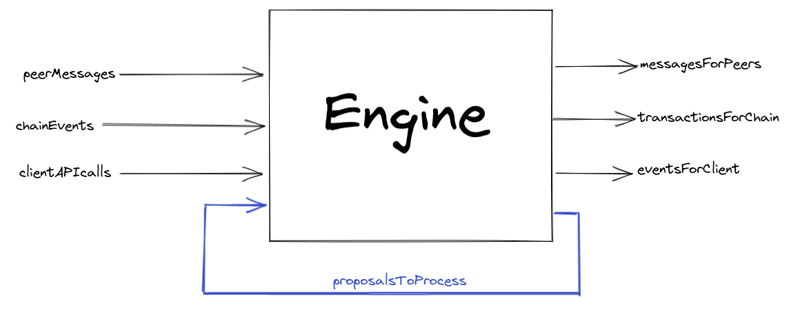

# 0006 -- Proposal Processing - LedgerChannel SideEffects

## Status

Accepted

## Definitions

- references to **virtualfunding** objectives are intended as generic references to either `virtualfund` or `virtualdefund`.

## Context

See [ADR-0003](./0003-consensus-ledger-channels.md), [ADR-0005](./0005-proposal-processing-related-objectives.md) for additional context. This ADR supersedes ADR-0005.

### Preamble

`go-nitro`'s initial design intent centered around a simple, dumb, engine which:
- recieves messages from either
  - the client; some consuming application
  - a network peer
  - a chainservice
- applies the contents of these messages to running proposals
- cranks running proposals, generating side effects
- executes these side-effects (sends messages, submits chain transactions)

The described engine is _dumb_ in so far as it:
- contains very little branching logic
- knows (and cares!) very little about
  - the contents of the messages being received
  - the objectives which are being updated / cranked

This _dumbness_ is desirable because it 
- makes engine execution easy to reason about, and
- forces the majority of protocol complexity directly into the protocol implementations themselves

### Evolving Responsibilities

As development progressed, the engine has taken on additional logical complexity / responsibilities. The `RelatedObjectives` mechanism described in ADR-0005 was an example of this engine-responsibilty-sprawl. In effect, it added an extra post-crank step to virtualfunding operations which sometimes resulted in chains of further objective cranks.

## Decision

The `RelatedObjectives` workflow has been replaced with a `SideEffects`-`ProposalQueue` workflow which more closely mimics the initial design intent outlined above.

Now, any `virtualfunding` objective whose `Crank()` progresses the state of some ledger channel checks that ledger channel for any further pending propsals. If it finds any, it returns a `ProposalToProcess` side effect, which gets piped back into the engine in the same manner as any of the existing APIs (peer messages, chain service, client application).

The engine regains some of its blissful ignorance. It doesn't know in advance which objective cranks might produce these proposal side-effects. After the fact, it doesn't know anything about where the ProposalProcessing requests are coming from.

### Details

This workflow replaces the sequential, synchrohous processessing of queued proposals with an async model. It is now possible (and in practical terms, likely) that a ledger channel with multiple queued proposals may not have those proposals processed sequentially by the engine at the exclusion of other incoming messages.

IE, if channel `L` contains queued proposals `X` and `Y`, then the crank which returns `X` to the engine along the `proposalsToProcess` channel may find that the engine already has incoming messages on one of the other incoming channels (`peerMessages`, `chainEvents`, `clientAPIcalls`), and similarly for the `X`-induced crank which returns `Y`. In these cases, the engine processes events in no specific order.

This is **OK** because no "competing" incoming event should alter the **readiness** of proposals `X` and `Y` for processing. It is possibly **desirable** because it anticipates a future async engine, which may seek write-access to the ledger channel in order to add to its ProposalQueue. Under the previous model, the ledger channel would be locked for the duration of the proposal queue clearing.