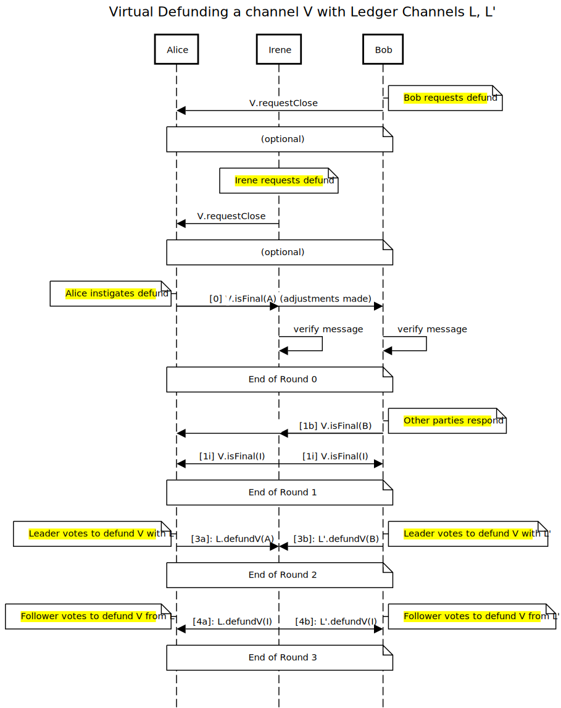

# 0007 -- Virtual Defund protocol

## Status

Accepted

## Context

We have adopted a _voucher_ based payment system for virtual channels in `go-nitro`. Vouchers are not state channel updates in the usual sense -- they do not increase the turn number for a virtual channel `V` -- instead, they are simple messages which reference `V`, an `amount` plus a signature on that pair. They are a "replace-by-incentive" mechanism, so need no index or turn number of their own.

For simplicitly, we assume a simplex (one-way) payment channel where participant `0` (Alice) pays participant `n+1` (Bob) in a channel hopping over `n` intermediaries.

To virtually defund `V`, we therefore need to resolve the payment vouchers into a finalizable state update in `V`. Once all parties have the finalization proof for `V`, they can proceed to propose / accept ledger channel updates which "unplug" `V` from the 2 (or more) ledger channels (`L`, `L'`,...) which guarantee it.

## Definition

An outcome is **reclaimable** when it allocates the same total funds to the same destinations as the postfund state.

This is an important property, since if there is no money allocated, no money can be reclaimed; and if the expected destinations aren't in the outcome, reclaim will revert.

## Decision

- Alice instigates the virtualdefund protocol.
- She sends an `{isFinal: true, turnNum: 3}` state for `V` "adjusted" by the latest (largest amount) voucher to all other participants. Adjusted means the voucher amount is deducted from Alice's allocation and added to Bob's.
- The intermediaries verify that the final state has a reclaimable outcome. Then, they countersign and broadcast their signature to all other participants.
- Bob also verifies that state, additionally requiring the adjustment amount to be equal to or larger than the largest voucher he has received.
- Bob broadcasts his own signature on the final state to all other participants.
- When they have all signatures on a final state, the leader in each ledger channel proposes to defund `V`.
- If they have all signatures on a final state, the follower in each ledger channel agrees (countersigns the ledger update).

## Justification

Although there may be some benefit to having a “symmetric” protocol — we wouldn’t have to switch on the participant role as much when implementing it -- we are instead adopting an asymmetric protocol with each role behaving rather differently.

The roles in the virtual channel are very distinct. We can leverage these distinctions to end up with a simple protocol:

1. There is a strong incentive bias between Alice and Bob (at least for a simplex channel).
2. Intermediaries (e.g. Irene) are not involved in voucher exchange at all during payments (in fact, this is the main selling point of virtual channels), so they need not be involved with vouchers during defunding either. As long as there is a single voucher amount agreed by Alice and Bob (i.e. resolved into the final state of `V`), their position remains neutral independent of whatever that amount is.

### Details

Alice will be programmed to construct a final state for V **which has its outcome adjusted with the latest voucher.** There is an opportunity for her to be malicious here and send a lower voucher / stale voucher. She sends the state to the other participants in a message. The message has a header (or type) “virtual defund instigation message” and includes sufficient data for those participants to verify that the update is acceptable: the final state and the signature. Bob will need to compute the effective voucher amount himself (Alice could send it, but Bob needs to verify anyway). This is so he can check it against his local largest voucher. Intermediaries need to check for reclaimability.

Bob’s node will get the message and trigger a verification procedure. All he cares about is that the adjusted outcome is **as good or better as** he expects given _his_ latest voucher. So if the special message comes in ahead of the actual latest voucher, he will be pleasantly surprised and continue with the protocol. If a malicious message comes in (Alice knowingly sending a low voucher), he will ignore it.

If every one is happy / successfully verifies, signatures will be broadcast and all parties now hold a finalization proof.

In the final round, the leader in each ledger channel proposes that V is defunded, and the follower agrees. The protocol progresses in the same way as virtual funding, only with guarantees being removed (instead of added) to the ledger channels. This is described in [ADR 0003](./0003-consensus-ledger-channels.md).

### Upsides

This protocol has the following properties:

- Equitability: Anyone can trigger the channel to close / be defunded (assuming cooperation, of course).
- Robustness: Messages arriving out of order are not too problematic, as long as Alice sends her latest voucher. She may get lucky and close the channel with a stale voucher amount only if larger vouchers got dropped / delayed -- but then Bob would not have provided the goods/services for those vouchers anywy.
- Explicitness: Bob’s verification of the voucher is very important and is highlighted here.
- Simplicity: Irene does not need to be involved until Alice and Bob are agreed. She doesn’t even need to understand vouchers.

### Downsides

- Redundancy: Some messages seem "unecessary" -- for example, prodding Alice to start the protocol.
- Asymmetry: Each participant behaves quite differently.
- Fragility: There's no attempt to recover if something goes wrong. Bob's verification could fail (but this likely indicates "Malice from Alice"). Messages could be dropped. This can probably be handled with general "retry logic", though.
- Vagueness: Although Bob holds largest voucher with amount `x`, but will agree to close the channel with any `y>=x`.

### Diagram

The below diagram shows the happy path in the case of a single intermediary:

|

Edit this diagram [here](https://sequencediagram.org/index.html#initialData=C4S2BsFMAIDUQE7AK4ENzQCKQGbIHYAmI+A5tKtAMYAWq++kGs0A7mDdADKSGmQJoAYToMmAZ24AabgHIAUPIAOqJCCogV+YNABEAQXDrIuipP3LVoDVp26AkgkiNTqSfctqb9OwCEA9gBGrpK+iioI6FDg8vj+wDAIIKQ0Ov440L7QAFzQADyBqFQA1qQI-gSE2QDEAJ5M4P6sAHwBgdBOAI7IkOLAkoS4lfK+ALTN+rmwAHRdPX1CjeKQnlFM0Ok4sfEw-gBuAtD6Ur65ABT+SqD++OgAlIpxCRsHgvY5+YUlZRVENfXgRotRzORKQbq9frQQZ4IirQFMeT2caTOCzcHzYCLfzLeHRDY4LZPXavI4nc6Xa63cAPPGI4nQKA4NIZfQfApFUrlSr-BpNCZGKgwEh9ZKoBIDIZw-TjU7QADaAAYALpokDiABiJHQZ30d2gZ1QhAAVsg+gBbZxQ81GyAPCJrDCbEay3KvEA4WrQS3icSofjbZ77Q7HOUAUSIBOgACVfoRoIrwqpHYHEslUlGsrkOd9uX86nyWm1oDh-AhWKpCJIcNqMOJki7mvZcvKAIyqmbqrXU3Une3JhFOwmpl4h8nQCPx9IxuPQVuKEfBt7sr5cuO8wH8kGMaCBcpGqhuKE16nQeukOkxZETFsAJlQHemXdrZ3sD2vcvlt8Cj+fPbfl4EkSOyjoIoa5JOUaxpU0C3gugEjkyLJHCunI-DyBabi0PC2oIew7JIwD+NCUrxiw7DAJwXDyDKTYtgAzA+uRcNMMKVLAuoPGMdEKvRP7MbIrGkRxvgPAySQpMhWafGheZVJhQLNDhgx4QR0BESRsJkWwHByIBzqLqS4ETpG07QZG9FJpEg6IbgyFstmq7ofmAKKRq-hYYc+ESupxFsZGLA4OU5rcEiKItgALEx3BCVpHEAeJ6ZSahubrgp-LuZ5qk+Rp-naUF-ghVwCgfpF-FyLF7Gvv21n4s6DJLmS4amRk5nxhFQA).
