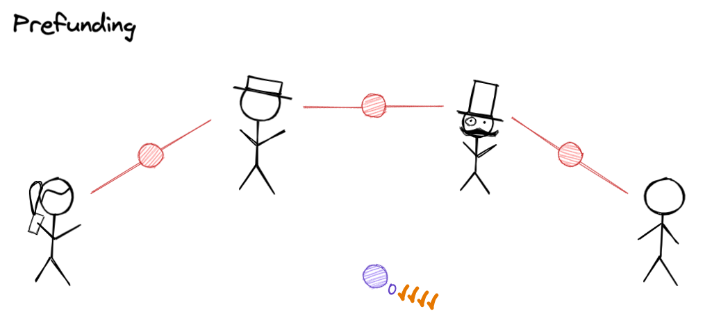
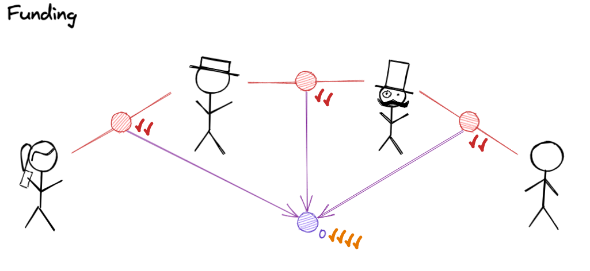
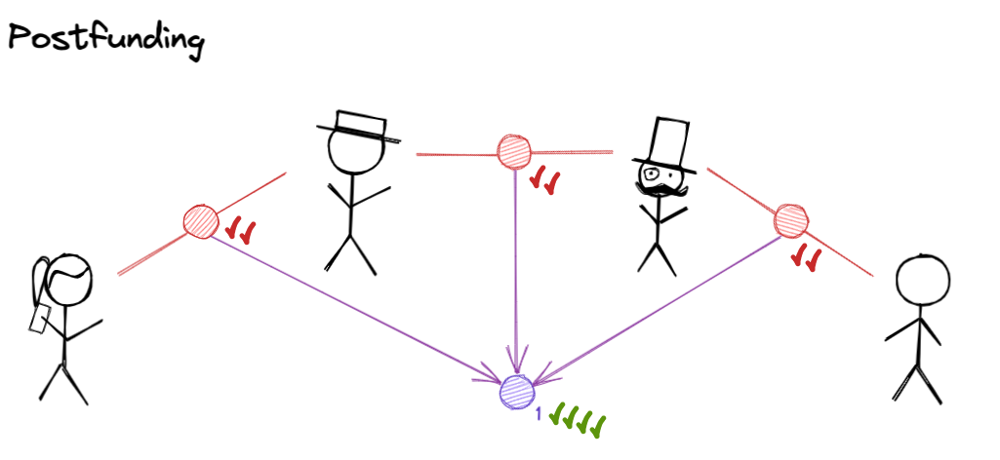
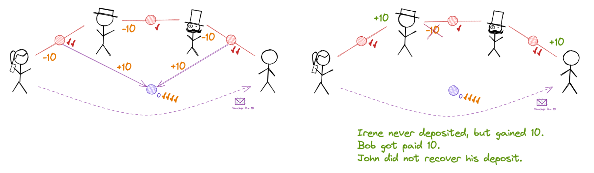

# 0009 - Clarification on role of postfund signatures in virtual channels.

## Status

Accepted

## Context

This work is based on [RFC 18](https://www.notion.so/statechannels/RFC-18-Clarify-purpose-of-virtualfund-postfund-round-and-allow-intermediaries-to-exit-early-2e5cd47aeeb2458b904dfff7463f9f1c)

Although (at the time of writing) the `virtualfund` protocol is concerned only with a `V` which is a unidirectional (simplex) payment channel, this ADR is written to still apply when that assumption is lifted.

The gas expenditure during on chain operations is not taken into account in this document.

### What is the virtual fund protocol for?

Let’s review the point of the `virtualfund` protocol and its various stages.

The prerequisites for `virtualfund` are a **route** between Alice and Bob through `n > 0` intermediaries, where the route is composed of pairwise **ledger channel** links with sufficient “free” capital to guarantee some net movement of funds between Alice and Bob.

The ultimate aim of `virtualfund` is to result in the creation of a new channel `V` in each of the `n+2` participants’ node’s store, guaranteed by the existing ledger channels in the route. The channel will be **safe to use**.

**Safe to use** means that each party has **an unbeatable strategy** to extract a **fair amount of money** from the channel. For each participant, a **fair amount of money** is that participant's deposit (i.e. their total deductions in favour of `V` across all ledger channels guaranteeing `V`) plus the net amount of assets signed over (by way of vouchers or any other mechanism enforceable on chain). The net amount would be zero for intermediaries (assuming no fees are extracted, for simplicity), positive for a net receipient of funds and negative for a net remitter of funds.

The **unbeatable strategy** depends on the states and signatures which each party holds.

To reach this goal, each party’s node goes through some intermediate states (”states” here not to be confused with state channel states). The `virtualfund` protocol is designed such that the intermediate states imply each participant is able to recover their **fair amount of money**.

### How is this achieved through the use of objectives?

An objective is a running protocol, in the same way that an OS process is a running program. "Task" might be a better name.

The way objectives implicitly protect users is to **wait** for certain events to happen before creating (and broadcasting) commitments on behalf of the user. One such event is objective approval, which is an explicit permission given by the user to the node — to begin progress toward the ultimate goal of the objective. The other events tend to be state commitments (i.e. a state plus a signature).

In the case of `virtualfund`, objective approval results in a prefund state (`turnNum = 0` ) for the virtual channel `V` being signed and broadcast.

The pause-points of the `virtualfund` protocol, arranged in a flowchart / statechart. When the objective clears a pause point, it typically makes new state commitments. If this RFC were adopted, intermediaries would skip the final pause point altogether.

Whenever a state commitment is made by one node, it confers rights/abilities on other nodes. Another way to think about that is that by making a state commitment, a party has relinquished their ability to prevent other nodes finalising the state in question on chain. In the terminology of the [nitro paper](https://magmo.com/nitro-protocol.pdf), the state (and its outcome) have been **enabled**.

### Step-by-step protocol walkthrough

Let me introduce Alice, Irene, John and Bob. Until the prefund stage is finished, no state can be finalised on chain by anyone.

Signing a prefund state enables it.

The rules of `VirtualPaymentApp` dictate that the prefund is supported when all participants have signed it (unanimous consensus):

[go-nitro/VirtualPaymentApp.sol at 13919093b8b8db0d69b7d0007af3ee3b5fd12aaa · statechannels/go-nitro](https://github.com/statechannels/go-nitro/blob/13919093b8b8db0d69b7d0007af3ee3b5fd12aaa/packages/nitro-protocol/contracts/VirtualPaymentApp.sol#L46-L50)

This is shown in the diagram above as `n+2` check marks (one for each intermediary plus one from each of the payer and payee).

For each node, it is safe to divert funds to the virtual channel only when they hold a support proof for the prefund state (since those funds may otherwise get locked forever). Moving funds out of a channel on chain can only happen if the channel is finalized on chain. Moving funds out of a channel off chain should only happen if the funds could be moved out of the channel on chain. No node should move funds into a channel without assurance that they can be moved out again.

Next, a node will enable an update to one or two ledger channels `L_i` which will divert funds to `V`.

If an update in `L_i` becomes finalizable, money may be moved from `V` back to `L_i` by finalising `L_i` and `V`, and calling `reclaim` on the Adjudicator.

[go-nitro/MultiAssetHolder.sol at 13919093b8b8db0d69b7d0007af3ee3b5fd12aaa · statechannels/go-nitro](https://github.com/statechannels/go-nitro/blob/13919093b8b8db0d69b7d0007af3ee3b5fd12aaa/packages/nitro-protocol/contracts/MultiAssetHolder.sol#L246)

At any point during this stage, each party can recover their fair amount of money by finalizing `V` with the prefund state and reclaiming up to 2 guarantees in their ledger channels. It is important that **no other** state for V may be finalized.

When funding is complete from the point of view of each node, they begin to sign the postfund. Once the postfund is supported, vouchers may be redeemed on chain.

In this round, participants sign the postfund of V (`turNum=1`).

It is not necessarily useful to think of it as “a round”. Funding and Postfunding may be interleaved if some participants feel ready to move on but others haven’t yet done so.

The on chain rules stipulate that **Bob can force a transition with a voucher only from a fully countersigned post fund state:**

[go-nitro/VirtualPaymentApp.sol at 13919093b8b8db0d69b7d0007af3ee3b5fd12aaa · statechannels/go-nitro](https://github.com/statechannels/go-nitro/blob/13919093b8b8db0d69b7d0007af3ee3b5fd12aaa/packages/nitro-protocol/contracts/VirtualPaymentApp.sol#L60-L65)

So by withholding a post fund signature, any intermediary can prevent the vouchers being redeemed by Bob and therefore prevent the vouchers being trusted by Alice and Bob. This is the current role of the post fund setup state. It’s important because intermediaries can lose money if vouchers are redeemable too early (see Epilogue below).

Let’s consider which `L_i` updates matter for each participant. It should be clear that a participant only cares about the updates in channels where funds may flow to them. In general this will be all of the `L_i` channels participated in, but in the case of a simplex payment channel there may be one ledger channel which is not important for a participant to wait on.

## Conclusion

Now we know that the postfund is an important thing for intermediaries to withhold for a time, but not something they need to wait on themselves.

The aim of the RFC is to allow intermediaries to be _required_ to sign the postfund, but not to wat on a full postfund before exiting the protocol themselves. If they want to defund `V`, they can finalize it with the prefund state. It may end up getting overwritten with a different state, but they can still extract their fair amount of money regardless.

## Epilogue

According to [SATP](https://docs.statechannels.org/research-papers/#2022-stateful-asset-transfer-protocol)

> In a unidirectional virtual channel – one where Bob initially deposits 0 – it is
> possible to entirely eliminate [the post fund setup round] from [virtualfund].

It should be clear that with the current execution rules, this is not true.

**But what if the rules allowed Bob to force a transition from a supported prefund state?** That would seem to be the implication of the quote from the SATP paper above. This would mean V could finalize with an arbitrary\* outcome as soon as the prefund is supported, when anywhere from 0 to the full amount of ledger channels have been updated. Is this ok? This is not safe for intermediaries as the following example shows:

If the rules allowed V to be finalized with vouchers as soon as the Prefund state was supported, it would not be safe for intermediaries to commit funds. In this example, Irene withholds a signature on the updated in the Irene-John channel. All funds are transferred to Bob in `V`, but the broken link in the ledger channel route means John loses out when `V` is defunded. By only allowing vouchers to be valid once the Postfund is supported, the rules allow any party to delay the point where vouchers become valid. They should delay until all of the channels where money may flow (net) to them are updated to fund `V`.

In this example, if the voucher is considered invalid by the adjudicator, then everyone gets back what they put in when reclaiming funds from `V` on chain.

So again, the postfund round is there to protect intermediaries. They only enable vouchers to be redeemed once all ledgers are plumbed in — or more accurately, once all intermediaries signal that they are happy (which they should only happen when all ledgers where money may flow to them have been plumbed in).

Even in the case of a unidirectional channel, the post fund round seems important. Therefore I do not think the quote from the satp paper is correct.

To be fair, the quote could be correct but simply vague. The protocol can be made safe without a postfund round by having each party only update the ledger where they stand to lose **after** they update the ledger where they stand to gain. This would resemble a lightning payment: Alice would enable the update committing funds on the left,**then\*\*** Irene countersigns it and then enables the next link over, **then** John countersigns it and enables the next link over, …., finally Bob countersigns the final link and sends an out-of-band message (it doesn’t need to be signed) to Alice to signal that he is ready to receive vouchers. However, it is not clear this approach actually saves any time, since it introduces a lot of blocking into the protocol. Probably better to let those updates all happen in parallel, which is what the postfund signatures allows for.
