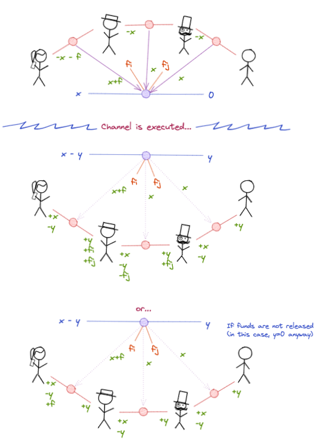

# 0010 - A mechanism for granting fees to virtual channel intermediaries

## Status

Accepted

## Context

This work is based on [RFC 20](https://www.notion.so/statechannels/RFC-20-Introduce-a-fee-model-for-intermediaries-dce28ac74d764fcf93db7d6b5cf05b3a)

Intermediary fees are an essential feature. It allows incentivization for intermediaries and thereby gives a sustainable way for a state channel network to operate.

At the time of writing the `virtualfund` protocol is concerned only with a `V` which is a unidirectional (simplex) payment channel. This ADR relies on that assumption and will need to be revisited if that assumption is lifted.

## Desiderata for a fee mechanism

- It should be free to receive money (fees are borne by the payer).
- Intermediaries are compensated for / incentivised to front the capital required to enable virtual channels.
- Fees should be considered variable -- parties can negotiate based on a model which can grant a different fee to each intermediary, which can depend on the amount of collateral staked, and which can depend on the length of the route (number of hops) in the virtual channel protocol.
- It should be secure (fees cannot be stolen or unfairly distributed).
- Fee disbursal should be conditional on a virtual channel having been at least funded.
- Fees must be ring-fenced so they may never be double-spent

## Non-goals

- Fees in bidirectional (duplex) payment channels.
- Fees which change during channel execution.
- Having fees depend on time.

## Nice to have

- Fees are disbursed in-protocol, meaning they can be used to increase the capital available for intermediaries to re-stake (compounding fees).

## Guide

The prefund state of the virtual channel (which serves the purpose of the payer proposing the channel to the intermediaries and the payee) is modified to include an outcome allocation for each intermediary.

Alice, being the payer and therefore the fee-payer, needs to deposit all of the funds `f` stipulated in `V` from her ledger channel as well as her initial balance `x` in `V`. Her direct intermediary will check this before countersigning an update in the relevant ledger channel.

Once the channel `V` is executed, it may be defunded. Computing the correct adjustments is a two step process:

1. Compute the usual adjustments enshrined in the existing `reclaim` method, based on the finalized outcome of `V`.
2. If `V` was finalized in at least turnNum 1 (post fund), release the fees:
   - compute the amount of fees which need to move in ledger channel `i` by constructing the partial sum of each intermediary's balance:
   - no fees move in ledger channel with greatest index
3. If `V` was _not_ finalized in at least turnNum 1 (post fund), refund the fees to Alice the payer

## Reference

## Alternatives (rejected)

- Sorting fees entirely out of band

  - Kicks can down the road.
  - Doesn't allow for the use of important synchronization / security mechanisms.
  - No compounding of fees.
  - Fees cannot easily be made trustlessly conditional on good behaviour.

- Sorting fees _somewhat_ out of band

  - Intermediaries could refuse to countersign ledger channel updates unless they atomically grant fees
  - Falls foul of the synchronization problem / fees can be stolen.

- Having fees awarded inside vouchers
  - This would allow Alice and Bob to cut out the intermediaries, so is unacceptable.
