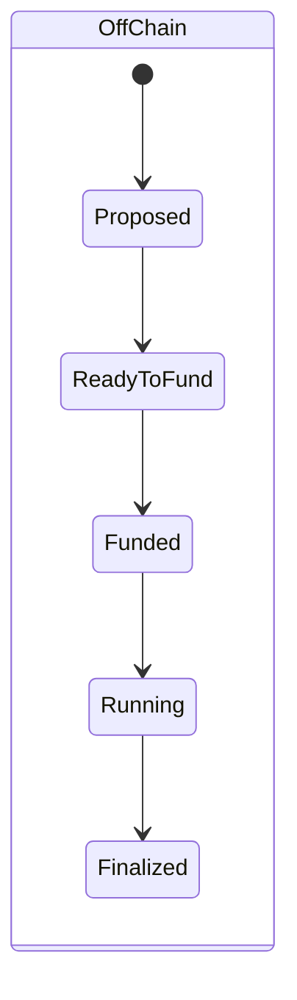
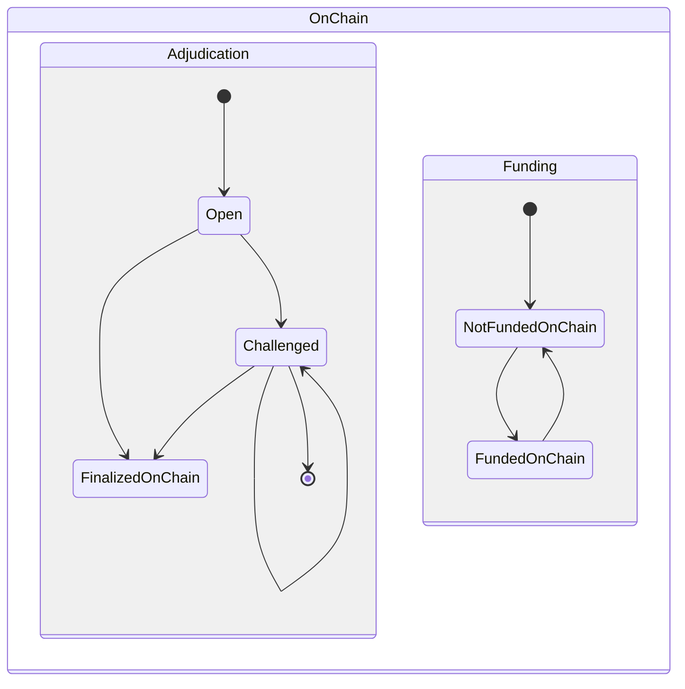

# Lifecycle of a state channel

"State" is a highly overloaded term in this context. Here we'll consider the "state" of a state channel as composite of three states -- the off chain state, the on chain _adjudication state_ and the on chain _funding state_. The off chain state may be different for each participant in the channel, whereas the on chain state is considered consistent (up to issues to do with finality and chain reorgs).

## Off-chain lifecycle

### Transitioning to `Proposed`

This happens as soon as a participant commits to a state with `turnNum=0` known as the **prefund** state.

### Transitioning to `ReadyToFund`

This happens when all participants commit to the **prefund** state, i.e. when all prefund signatures are in hand.

### Transitioning to `Funded`

This happens when all participants commit to a state with `turnNum=1` known as the **postfund** state. Each participant should only make this commitment when one of the following is true:

- sufficient deposits are accrued on chain against the channel in question
- sufficient money is directly allocated to the channel in question from an existing funded channel
- sufficient money is _guaranteed_ to the channel in question from an existing funded channel

For more detail see the section on [funding](./0005-funding-a-channel.md).

### Transitioning to `Running`

This happens when a state with `turnNum > 1` becomes supported.

### Transitioning to `Finalized`

This happens when all participants commit to a state with `isFinal=true`, i.e. when all final signatures are in hand.

## On-chain lifecycle

### Funding

When a channel is to be funded on chain, participants follow the [on chain deposit protocol](./0005-funding-a-channel.md#fund-with-an-on-chain-deposit). When sufficient funds are deposited against the channel, the state has transitioned to `FundedOnChain`. Funding on chain is often not necessary.

### Adjudication

The off chain state may be submitted to the adjudication contract at any time to trigger the adjudication status to transition to `Challenged`. It may then transition to `FinalizedOnChain` via a timeout, or back to `Open` via a `checkpoint` transaction, or indeed back to `Challenge` via another `challange` transaction.
