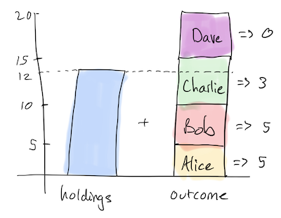

# Funding a channel

Early on in the lifecycle of a state channel -- i.e. after exchanging some setup states, but before executing any application logic -- participants will want to "fund it". They will stake assets on the channel so that the state updates are meaningful. The simplest way to do this is with an on chain deposit; a more advanced possibility is fund a new channel from an existing funded channel.

## Fund with an on-chain `deposit`

The deposit method allows ETH or ERC20 tokens to be escrowed against a channel.
We have the following call signature:

```solidity
function deposit(address asset, bytes32 destination, uint256 expectedHeld, uint256 amount) public payable
```

!!! warning

    There are a few rules to obey when calling `deposit`. Firstly, `destination` must NOT be  an [external destination](./0002-outcomes.md#destinations). Secondly, the on-chain holdings for `destination` must be greater than or equal to `expectedHeld`. Thirdly, the holdings for `destination` must be less than the sum of the amount expected to be held and the amount declared in the deposit.

    The first rule prevents funds being escrowed against something other than a channelId: funds may only be unlocked from channels, so you shouldn't deposit into anything else. The second rule prevents loss of funds: since holdings are paid out in preferential order, depositing before a counterparty has deposited implies that they can withdraw your funds. The check is performed in the same transaction as the deposit, making this safe even in the event of a chain re-org that reverts a previous participant's deposit. The third rule prevents the deposit of uneccessary funds: if my aim was to increase the holdings to a certain level, but they are already at or above that level, then I want my deposit to transaction revert.

If we are depositing ETH, we must remember to send the right amount of ETH with the transaction, and to set the `asset` parameter to the zero address.

```typescript
import { ethers } from "ethers";
import {
  randomChannelId,
  randomChannelId,
} from "@statechannels/nitro-protocol";

// In lesson5.test.ts

/*
      Get an appropriate representation of 1 wei, and
      use randomChannelId() as a dummy channelId.
      WARNING: don't do this in the wild: you won't be able to recover these funds.
  */
const amount = ethers.utils.parseUnits("1", "wei");
const destination = randomChannelId();

/*
    Attempt to deposit 1 wei against the channel id we created.
    Inspect the error message in the console for a hint about the bug on the next line 
*/
const expectedHeld = 0;
const tx0 = NitroAdjudicator.deposit(
  constants.AddressZero,
  destination,
  expectedHeld,
  amount,
  {
    value: amount,
  }
);
```

Otherwise, if we are depositing ERC20 tokens, we must remember to [`approve`](https://docs.openzeppelin.com/contracts/2.x/api/token/erc20#IERC20-approve-address-uint256-) the NitroAdjudicator for enough tokens before making the deposit.

### Outcome priority

{ align=left }
In Nitro, it is possible for a channel to be underfunded, exactly funded or overfunded at different points in time. Particularly during depositing, there are fewer funds held against the channel than are allocated by it (i.e. it is underfunded). If a channel were to finalize and be liquidated when underfunded (something which could happen), the funds would be paid out in priority order. This implies that depositing safely requires an understanding of that priority order -- in essence, participants should not deposit until those with higher priority have had their deposits confirmed.

## Fund from an existing channel

## Fund virtually

...from two or more existing channels
