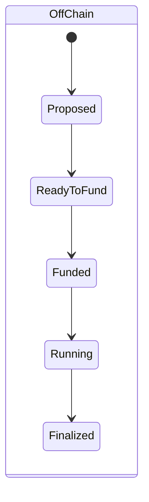
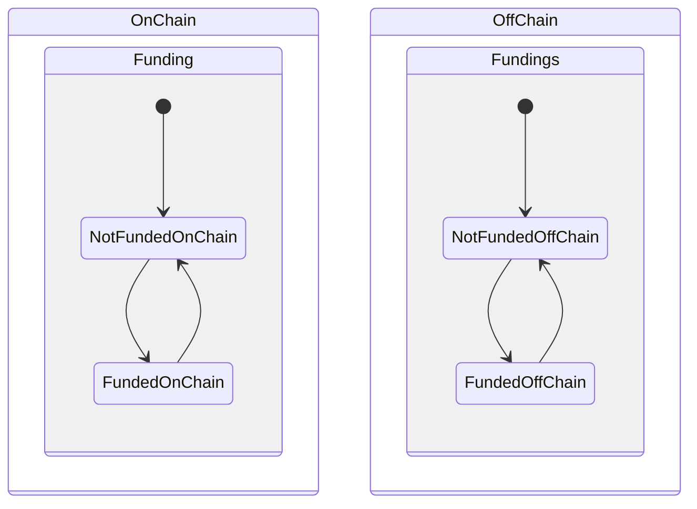
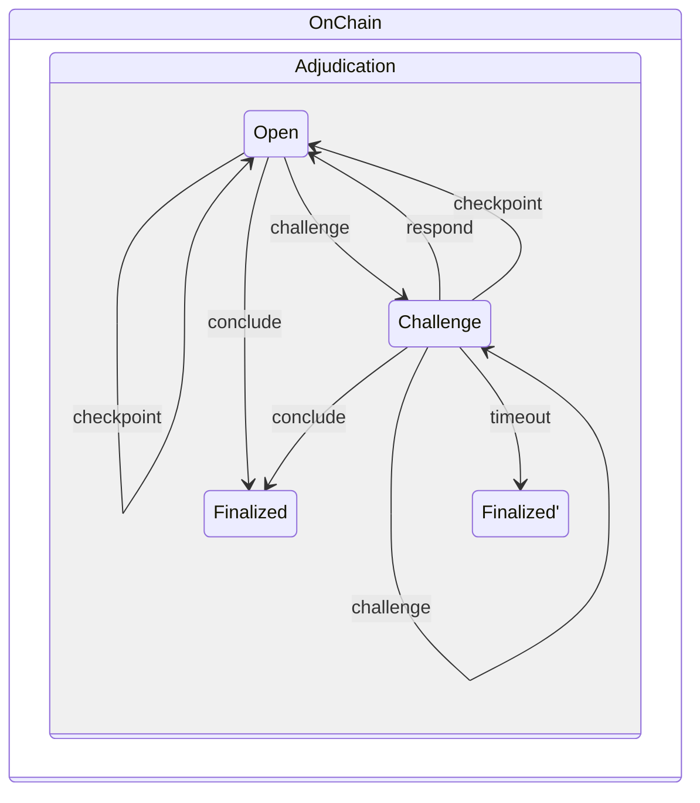

# Lifecycle of a state channel

In this section we'll consider the "state" of a state channel as composite of three states -- the _off chain state_, the on chain _adjudication state_ and the _funding state_ (which can be on or off chain). The off chain parts of the state may be different for each participant in the channel, whereas the on chain part of the state is considered consistent (up to issues to do with finality and chain reorgs).

!!! info

    "State" is a highly overloaded term -- in this section we take it to mean something different from the "state" of [the section on states](./0010-states-channels.md#states) (unless explicitly noted).

## Off-chain lifecycle

The off-chain lifecycle of a channel may be visualized like this:



The conditions for each state emerge from the collection of [states](./0010-states-channels.md#states) and [signatures](./0010-states-channels.md#state-commitments) held by each participant. Let's look at each in turn.

### `Proposed`

This state applies as soon as a participant commits to a state with `turnNum=0` known as the **prefund** state.

### `ReadyToFund`

This state applies when all participants commit to the **prefund** state, i.e. when all prefund signatures are in hand.

!!! info

    It is important to wait for a supported prefund before depositing any funds on chain, since this state is a guarantee that on chain funds can be unlocked with the intial (prefund) [outcome](./0030-outcomes.md).

### `Funded`

This state applies when all participants commit to a state with `turnNum=1` known as the **postfund** state. Each participant should only make this commitment when one of the following is true:

- sufficient deposits are accrued on chain against the channel in question
- sufficient money is directly allocated to the channel in question from an existing funded channel
- sufficient money is _guaranteed_ to the channel in question from an existing funded channel

For more detail see the section on [funding](./0060-funding-a-channel.md).

### `Running`

This state applies when a state with `turnNum > 1` becomes supported.

### `Finalized`

This state applies when all participants commit to a state with `isFinal=true`, i.e. when all final signatures are in hand.

!!! info

        Each state supercedes the previous ones in the sense that (for example) a channel is said to be `Funded` if it meets that condition, even though it also meets the condition for `ReadyToFund`.

## Funding

A channel may be funded _either_ on-chain or off-chain.

The state can be visualized like this:



### On-chain

When a channel is to be funded on chain, participants follow the [on chain deposit protocol](./0060-funding-a-channel.md#fund-with-an-on-chain-deposit). When sufficient funds are deposited against the channel, the state has transitioned to `FundedOnChain`.

### Off-chain

Funding on chain is often not necessary, since most channels are funded off-chain. In that case, the "funding state" of a channel is composed of the off-chain state of one or more other channels. See the section on [funding](./0060-funding-a-channel.md#fund-from-an-existing-channel).

## Adjudication

The off chain state may be submitted to the adjudication contract at any time to trigger the adjudication status to transition to `Challenged`. It may then transition to `FinalizedOnChain` via a timeout, or back to `Open` via a `checkpoint` transaction, or indeed back to `Challenge` via another `challange` transaction.

!!! tip

    Ideally channels are never adjudicated on chain. This only state applies  as a [last resort](./0070-finalizing-a-channel.md#sad-path) when cooperation has broken down.

# Adjudicator Status

The adjudicator smart contract is the main on-chain code governing the state channel network. It stores certain information about any channel that it knows about. Specifically, it stores data derived from the `ChannelData` struct, which contains:

```solidity

    struct ChannelData {
          uint48 turnNumRecord;
          uint48 finalizesAt;
          bytes32 stateHash; // (1)
          bytes32 outcomeHash;
    }

```

1. This is formed according to [this formula](./0010-states-channels.md#state-commitments).

The derived data is stored inside the following mapping (with `channelId` as the key):

```solidity
mapping(bytes32 => bytes32) public statusOf;
```

Generating a 32 byte `status` involves

- setting the most significant 48 bits to the `turnNumRecord`
- setting the next most significant 48 bits to `finalizesAt`
- setting the next most significant 160 bits to the `fingerprint`

The `fingerprint` helps to uniquely identify the channel's current state, up to hash collisions. It is computed as:

```solidity
uint160(
        uint256(
            keccak256(
                abi.encode(
                    channelData.stateHash,
                    channelData.outcomeHash
                )
            )
        )
    )
```

When the adjudicator needs to verify the exact state or outcome, the data is provided in the function arguments, as part of the `calldata`. The chain will then check that the hydrated data matches the status that has been stored.

!!! info

    `turnNumRecord` and `finalizesAt` can be read from storage straightforwardly, whereas the other `ChannelData` fields are only stored as the output of a one-way function. The input to this function must therefore be tracked in client code by monitoring the relevant contract events.

We provide a helper function to construct the appropriate status from a javascript representation of `ChannelData`:

```typescript
import {
  ChannelData,
  channelDataToFingerprint,
} from "@statechannels/nitro-protocol";

const channelData: ChannelData = {
  turnNumRecord: largestTurnNum,
  finalizesAt: 0x0,
};
const status = channelDataToStatus(channelData);
```

Here we omitted some of the fields, because the helper function is smart enough to know to set them to null values when finalizes at is zero. We'll be using this helper in the next tutorial lesson.

### `turnNumRecord`

`turNumRecord` is the highest turn number that is known to the chain to be supported by a full set of signatures.
The exception to this rule is that it is set to `0` when the channel is concluded via a `conclude` call.

For example, the `turnNumRecord` might be increased by a submitted `checkpoint` transaction including a [support proof](./0020-execution-rules.md#execution-rules) for a state.

Note that a new `validTransition` `m`-chain may be implied by a single, signed state that is a validTransition from a state already supported on-chain: and hence the `turnNumRecord` can be incremented by a `respond` transaction.

### Channel Modes

The `finalizesAt` part of the status, together with block timestamp, imply a channel is in one or the other of three modes:

```solidity
function _mode(bytes32 channelId) internal view returns (ChannelMode) {
  // Note that _getFingerprint(someRandomChannelId) returns (0,0,0), which is
  // correct when nobody has written to storage yet.

  (, uint48 finalizesAt, ) = _getFingerprint(channelId);
  if (finalizesAt == 0) {
    return ChannelMode.Open;
  } else if (finalizesAt <= now) {
    return ChannelMode.Finalized;
  } else {
    return ChannelMode.Challenge;
  }
}

```

These states can be represented in the following state machine:



Here `Finalized` and `Finalized'` are distinct states reflecting the fact that the on-chain storage is different in each case, although the implications are the same (the channel may now be defunded on chain).
