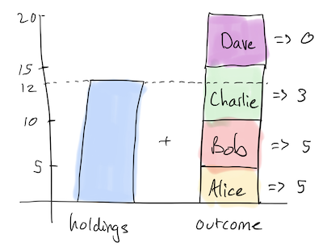
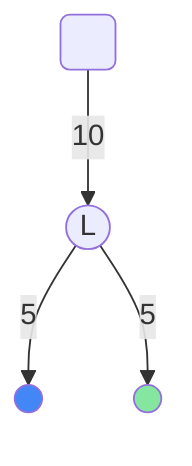
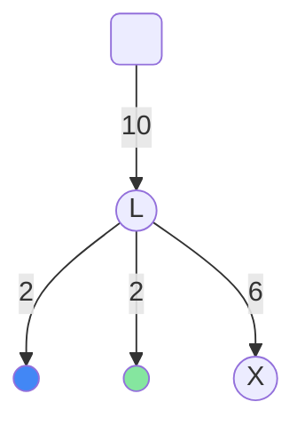
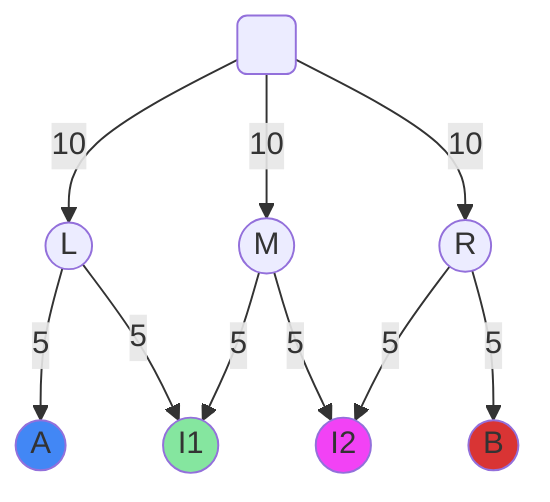
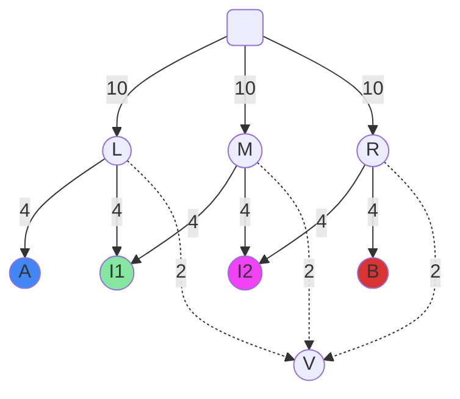

# Funding a channel

Early on in the [lifecycle](./0040-lifecycle-of-a-channel.md) of a state channel -- i.e. after exchanging some setup states, but before executing any application logic -- participants will want to "fund it". They will stake assets on the channel so that the state updates are meaningful. The simplest way to do this is with an on chain deposit; a more advanced possibility is fund a new channel from an existing funded channel.

## Fund with an on-chain `deposit`

The deposit method allows ETH or ERC20 tokens to be escrowed against a channel.
We have the following call signature:

```solidity
function deposit(address asset, bytes32 destination, uint256 expectedHeld, uint256 amount) public payable
```

!!! warning

    There are some rules to obey when calling `deposit`. Firstly, `destination` must NOT be  an [external destination](./0030-outcomes.md#destinations). Secondly, the on-chain holdings for `destination` must be equal to `expectedHeld`.

    The first rule prevents funds being escrowed against something other than a channelId: funds may only be unlocked from channels, so you shouldn't deposit into anything else. The second rule prevents loss of funds: since holdings are paid out in preferential order, depositing before a counterparty has deposited implies that they can withdraw your funds. The check is performed in the same transaction as the deposit, making this safe even in the event of a chain re-org that reverts a previous participant's deposit.

If we are depositing ETH, we must remember to send the right amount of ETH with the transaction, and to set the `asset` parameter to the zero address.

```typescript
import { ethers, constants } from "ethers";
import { randomChannelId } from "@statechannels/nitro-protocol";

/*
      Get an appropriate representation of 1 wei, and
      use randomChannelId() as a dummy channelId.
      WARNING: don't do this in the wild: you won't be able to recover these funds.
  */
const amount = ethers.utils.parseUnits("1", "wei");
const destination = randomChannelId();

/*
    Attempt to deposit 1 wei against the channel id we created.
    Inspect the error message in the console for a hint about the bug on the next line 
*/
const expectedHeld = 0;
const tx0 = NitroAdjudicator.deposit(
  constants.AddressZero, // (1)
  destination,
  expectedHeld,
  amount,
  {
    value: amount,
  }
);
```

1. This magic value declares that this is a native token deposit (e.g. ETH).

Otherwise, if we are depositing ERC20 tokens, we must remember to [`approve`](https://docs.openzeppelin.com/contracts/2.x/api/token/erc20#IERC20-approve-address-uint256-) the NitroAdjudicator for enough tokens before making the deposit, and then call deposit with the ERC20 token contract address as the first parameter (instead of the zero address).

### Outcome priority

{ align=left }
In Nitro, it is possible for a channel to be underfunded, exactly funded or overfunded at different points in time. Particularly during depositing, there are fewer funds held against the channel than are allocated by it (i.e. it is underfunded). If a channel were to finalize and be liquidated when underfunded (something which could happen), the funds would be paid out in priority order. This implies that depositing safely requires an understanding of that priority order -- in essence, participants should not deposit until those with higher priority have had their deposits confirmed.

## Fund from an existing channel

In most cases, there should be no need to pay the cost and latency of funding on chain. All it takes to fund a second channel (say, `X`) **off-chain** from a first (sa,y `L`) is to make a state update in `L`. The participants of `L` can collaborate to support a state with a modififed [`outcome`](./0030-outcomes.md). This is particularly straightforward if the first channel is running the [`ConsensusApp`](./0010-states-channels.md#consensusapp).

!!! info

    In this context, the channel `L` is known as a **ledger channel**.

Take for example an initial funding tree like this:



The diagram shows on-chain funding of `10` for `L`, which initially allocates `5` to each participant. The participants propose and countersign a modified outcome like so:

=== "Typescript"

    ```ts hl_lines="13 19 23 24 25 26 27 28 29"
    import {
      Exit,
      SingleAssetExit,
      NullAssetMetadata,
    } from "@statechannels/exit-format";

    const ethExit: SingleAssetExit = {
      asset: "0x0",
      assetMetadata: NullAssetMetadata,
      allocations: [
        {
          destination: "0x00000000000000000000000096f7123E3A80C9813eF50213ADEd0e4511CB820f", // Alice
          amount: "0x02", // (1)
          allocationType: AllocationType.simple,
          metadata: "0x",
        },
        {
          destination: "0x0000000000000000000000000737369d5F8525D039038Da1EdBAC4C4f161b949", // Bob
          amount: "0x02", // (2)
          allocationType: AllocationType.simple, // a regular ETH transfer
          metadata: "0x",
        },
        { // (3)
          // The channel id of the second channel:
          destination: "0xC4f161b9490737369d5F8525D039038Da1EdBAC4",
          amount: "0x06",
          allocationType: AllocationType.simple,
          metadata: "0x",
        },
      ],
    };

    const exit = [ethExit];
    ```

    1. This amount was decremented by 3.
    2. This amount was decremented by 3.
    3. This allocation was appended.

=== "Go"

    ```Go hl_lines="13 17 19 20 21 22 23"
      import (
        "math/big"

        "github.com/ethereum/go-ethereum/common"
        "github.com/statechannels/go-nitro/channel/state/outcome"
        "github.com/statechannels/go-nitro/types"
      )

      var ethExit = outcome.SingleAssetExit{
          Allocations: outcome.Allocations{
            outcome.Allocation{
              Destination: types.Destination(common.HexToHash("0x00000000000000000000000096f7123E3A80C9813eF50213ADEd0e4511CB820f")),
              Amount:      big.NewInt(2), // (1)
            },
            outcome.Allocation{
              Destination: types.Destination(common.HexToHash("0x0000000000000000000000000737369d5F8525D039038Da1EdBAC4C4f161b949")),
              Amount:      big.NewInt(2), // (2)
            },
            outcome.Allocation{ // (3)
              // The channel id of the second channel:
              Destination: types.Destination(common.HexToHash("0xC4f161b9490737369d5F8525D039038Da1EdBAC4")),
              Amount:      big.NewInt(6),
            },
          },
        }

      var exit = outcome.Exit{{ethExit}}
    ```

    1. This amount was decremented by 3.
    2. This amount was decremented by 3.
    3. This allocation was appended.

Bringing the funding graph to a state like this:



## Fund virtually

It is possible to virtually fund a channel with a counterparty via two or more channels which constitute an indirect pre-existing connection with that counterparty.

Take for example an initial funding tree like this:



Here `A` wishes to enter a channel with `B`, but only has a ledger channel with `I1`. However, since `I1` has a ledger channel with `I2`, and `I2` has a [ledger channel](#fund-from-an-existing-channel) with `B`, it is indeed possible to safely fund such a channel in the following way.

1. `A` proposes a channel `V` with participants `A,I1,I2,B`. Each participant has a numerical role in the virtual funding protocol. `V` allocates funds to `A` and `B`, but not to ther intermediaries `I1,I2`. The other participants join the channel. See [lifecycle of a channel](./0040-lifecycle-of-a-channel.md).
2. In each existing ledger channel (`L,M,R`), the participants of that channel make an update to include a guarantee for `V` in the outcome of the ledger channel.
3. When all of the ledger channels (there will be 1 or 2) which an actor is participating in have reached consensus on guaranteeing `V`, that actor signs the [postfund state](./0040-lifecycle-of-a-channel.md#off-chain-lifecycle) for `V`.
4. When the postfund round completes, the channel is considered funded.

Here is an example of step 2 for `M`, the ledger channel between `A` and `I1`:

=== "Typescript"

    ```ts hl_lines="13 19 23 24 25 26 27 28 29"
    import {
      Exit,
      SingleAssetExit,
      NullAssetMetadata,
    } from "@statechannels/exit-format";

    const ethExit: SingleAssetExit = {
      asset: "0x0",
      assetMetadata: NullAssetMetadata,
      allocations: [
        {
          destination: "0x00000000000000000000000096f7123E3A80C9813eF50213ADEd0e4511CB820f", // Alice
          amount: "0x04", // (1)
          allocationType: AllocationType.simple,
          metadata: "0x",
        },
        {
          destination: "0x0000000000000000000000000737369d5F8525D039038Da1EdBAC4C4f161b949", // Bob
          amount: "0x04", // (2)
          allocationType: AllocationType.simple, // a regular ETH transfer
          metadata: "0x",
        },
        { // (3)
          // The channel id of V:
          destination: "0x0737369d5F8C4f161b949525D039038Da1EdBAC4",
          amount: "0x02",
          allocationType: AllocationType.Guarantee,
          metadata: "0x00000000000000000000000096f7123E3A80C9813eF50213ADEd0e4511CB820f0000000000000000000000000737369d5F8525D039038Da1EdBAC4C4f161b949",
        },
      ],
    };

    const exit = [ethExit];
    ```

    1. This amount was decremented by 1.
    2. This amount was decremented by 1.
    3. This allocation was appended. Notice that it is a [guarantee allocation.](./0030-outcomes.md#guarantees)

=== "Go"

    ```Go hl_lines="16 20 22 23 24 25 26 27"
      import (
        "math/big"

        "github.com/ethereum/go-ethereum/common"
        "github.com/statechannels/go-nitro/channel/state/outcome"
        "github.com/statechannels/go-nitro/types"
      )

      var aliceDestination := types.Destination(common.HexToHash("0x00000000000000000000000096f7123E3A80C9813eF50213ADEd0e4511CB820f"))
      var I1Destination := types.Destination(common.HexToHash("0x0000000000000000000000000737369d5F8525D039038Da1EdBAC4C4f161b949"))

      var ethExit = outcome.SingleAssetExit{
          Allocations: outcome.Allocations{
            outcome.Allocation{
              Destination: aliceDestination,
              Amount:      big.NewInt(4), // (1)
            },
            outcome.Allocation{
              Destination: I1Destination,
              Amount:      big.NewInt(4), // (2)
            },
            outcome.Allocation{ // (3)
              // The channel id of V:
              Destination: types.Destination(common.HexToHash("0x0737369d5F8C4f161b949525D039038Da1EdBAC4")),
              Amount:      big.NewInt(2),
              Metadata: append(aliceDestination.Bytes(), I1Destination.Bytes()...)
            },
          },
        }

      var exit = outcome.Exit{{ethExit}}
    ```

    1. This amount was decremented by 1.
    2. This amount was decremented by 1.
    3. This allocation was appended. Notice that it is a [guarantee allocation.](./0030-outcomes.md#guarantees)

Note how the additional allocation is a [guarantee allocation.](./0030-outcomes.md#guarantees) and has appropriately encoded metadata. If the ledger channels are labelled `L_i` and ordered left to right by participant role, the `left` metadata field in `L_i`'s guarantee is set to participant `P_i`'s destination and the right metadata field is set to participant `P_(i+1)`'s destiantion.

And once steps 1-4 are complete, the funding graph looks like so:



This construction generalizes, and works with anything from `1` , `2` (as shown here) or `n` hops.

Channel `V` may be used for `A` to send payments to `B`, for example: see [virtual payment app](./0020-execution-rules.md#virtualpaymentapp).

The full offchain protocol for virtually funding a channel can be understood by reading the implementation [readme](https://github.com/statechannels/go-nitro/tree/main/protocols/virtualfund).
