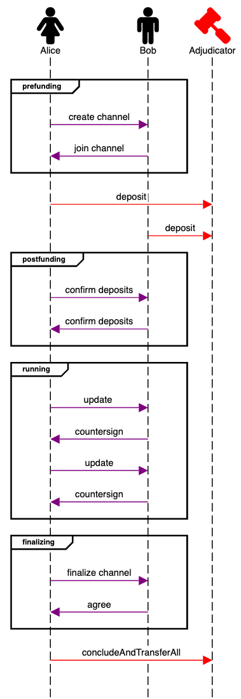
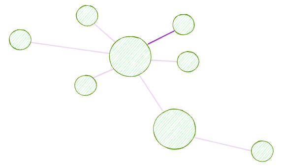
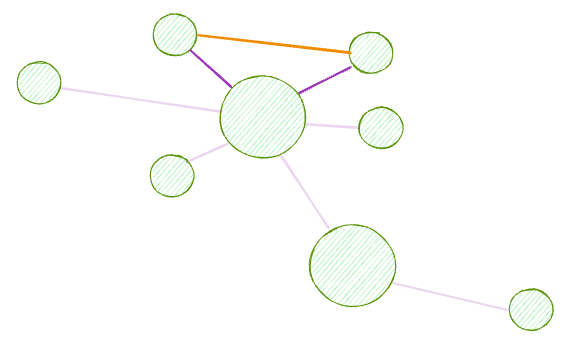
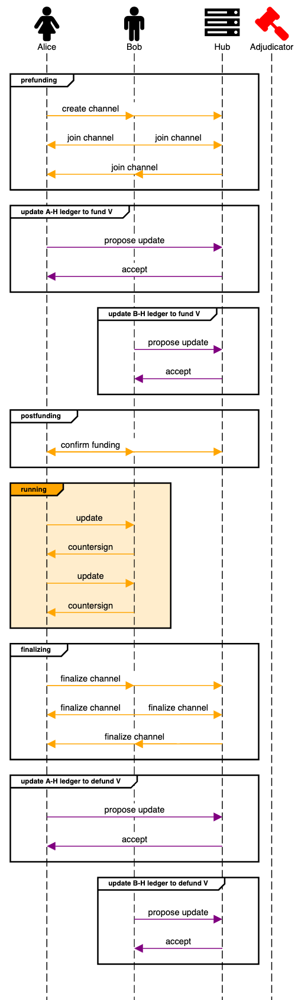
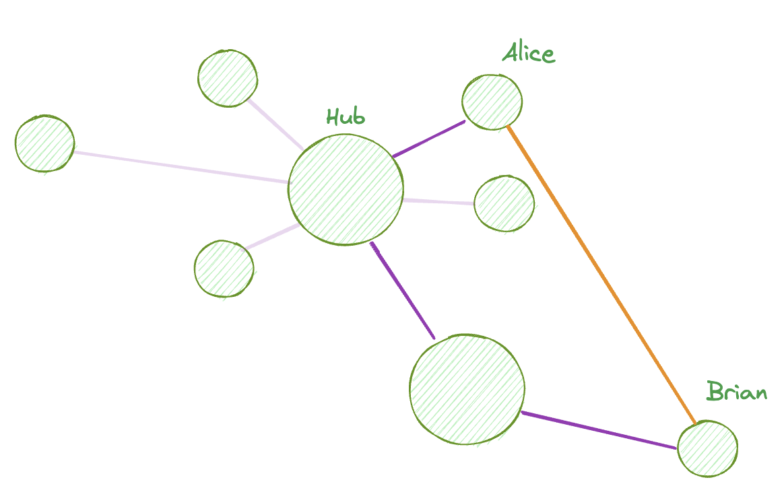

# User Flows

This page describes how the Nitro framework can be used at increasing levels of scalability.

# Basic

A very simple interaction involves just two parties, Alice and Bob, who transact off-chain. After prefund states are exchanged, at least one of them [deposits into the adjudicator](../protocol-tutorial/0060-funding-a-channel.md) in priority order. Then, after postfund states are exchanged, the channel may be [executed according to the rules of the channel](../protocol-tutorial/0020-execution-rules.md). Then, Alice and Bob may agree to finalize, conclude and liquidate the channel.

<!-- fontawesome f182 Alice
fontawesome f183 Bob
fontawesome f0e3 Adjudicator #red

group prefunding
Alice-#purple>Bob: create channel
Alice<#purple-Bob: join channel
end
Alice-#red>Adjudicator: deposit
Bob-#red>Adjudicator: deposit
group postfunding
Alice-#purple>Bob: confirm deposits
Alice<#purple-Bob: confirm deposits
end
group running
Alice-#purple>Bob: update
Bob-#purple>Alice: countersign
Alice-#purple>Bob: update
Bob-#purple>Alice: countersign
end
group finalizing
Alice-#purple>Bob: finalize channel
Alice<#purple-Bob: agree
end
Alice-#red>Adjudicator: concludeAndTransferAll -->

# Advanced

The basic flow shown above is essentially a very small, two party state channel network. Nitro protocol allows for far larger and more powerful networks to be built which bring major scalabilty advances.

The first step for any particular node in the network is to **join** by creating a so-called **Ledger Channel** (purple). This is a two-party channel connecting the node to an existing nitro node, backed by at least one on-chain deposit. The existing nitro node is likely to be a so-called "hub" node, meaning that it tends to command a large amount of capital and be very well connected to other nodes.

The execution rules of a ledger channel are typically very simple and are designed to govern the "application" of **funding other channels**. Imagine that Alice and Bob have never connected to each other directly by sharing an on chain deposit. They can establish a **virtual channel V** (orange) between themselves, and [fund it](../protocol-tutorial/0060-funding-a-channel.md#fund-virtually) by making making appropriate updates in a pair of ledger channels connecting them through a mutual hub:

The user flow for a virtual channel is like so:

<!-- fontawesome f182 Alice
fontawesome f183 Bob
fontawesome f233 Hub
fontawesome f0e3 Adjudicator #red

group prefunding
parallel
Alice-#orange>Bob: create channel
Alice-#orange>Hub:
parallel off
parallel
Alice<#orange-Bob: join channel
Hub<#orange-Bob: join channel
parallel off
parallel
Alice<#orange-Hub: join channel
Bob<#orange-Hub:
parallel off
end
group update A-H ledger to fund V
Alice-#purple>Hub: propose update
Alice<#purple-Hub: accept
end
group update B-H ledger to fund V
Bob-#purple>Hub: propose update
Bob<#purple-Hub: accept
end

group postfunding
parallel on
Alice-#orange>Bob: confirm funding
Alice<#orange-Bob:
Alice-#orange>Hub:
Alice<#orange-Hub:
parallel off
end
group #orange running
Alice-#orange>Bob: update
Bob-#orange>Alice: countersign
Alice-#orange>Bob: update
Bob-#orange>Alice: countersign
end
group finalizing
parallel
Alice-#orange>Bob: finalize channel
Alice-#orange>Hub:
parallel off
parallel
Alice<#orange-Bob: finalize channel
Hub<#orange-Bob: finalize channel
parallel off
parallel
Alice<#orange-Hub: finalize channel
Bob<#orange-Hub:
parallel off
end
end
group update A-H ledger to defund V
Alice-#purple>Hub: propose update
Alice<#purple-Hub: accept
end
group update B-H ledger to defund V
Bob-#purple>Hub: propose update
Bob<#purple-Hub: accept
end -->

Note how the highlighted "running" stage is identical as for the basic user flow above. Not also that the adjudicator contract on L1 is not involved in any part of opening, funding, executing or defunding the virtual channel.

# Multihop

This construction scales to multi-hop scenarios, which involve multiple hub connections like so:

