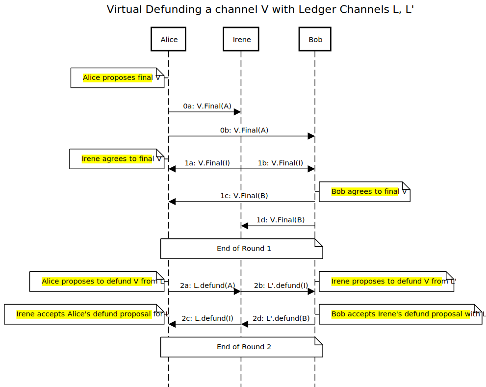

a# Virtual defund off-chain protocol

## Single hop case

Take three actors Alice, Bob and Irene. Given a ledger channel `L` between Alice and Irene and a ledger channel `L'` between Bob and Irene, the clients send and wait on messages as shown in the below sequence diagram in order to defund `V`

The diagram is generated at https://sequencediagram.org/. The source code for this diagram is co-located in this folder, and should be updated in concert with changing the diagram.
