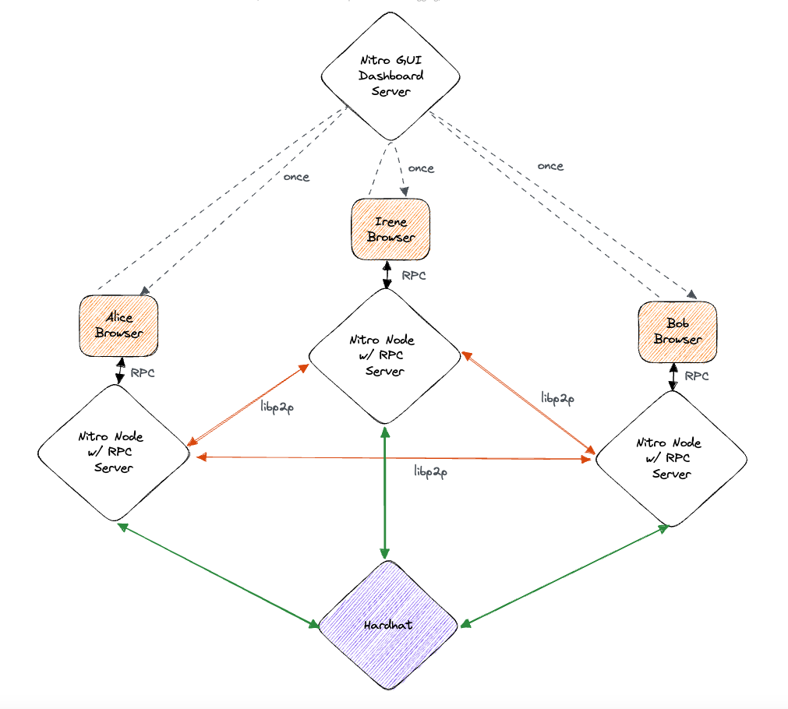

# Nitro typescript packages

This directory contains work related to a UI for a go-nitro node.

UI component demos deployed here: https://nitro-storybook.netlify.app/

Latest GUI from `main` branch deployed here https://nitro-gui.netlify.app/

## Packages

- package [`nitro-gui`](./nitro-gui) contains the web UI
- package [`nitro-rpc-client`](./nitro-rpc-client) contains a typescript library (and CLI tool) for communicating with go-nitro's RPC api.

## Storybook

Components can be viewed by running `yarn storybook` or `npm run storybook` from the `./nitro-gui` directory.

## Running manual integration tests

You will need to spin up:

- a local `hardhat network` instance running with default settings
- a GUI/Dashboard server (x1) `yarn dev` in the `nitro-gui` package
- `n` browser tabs loading the GUI from the above server (try `n=3` for example, Alice/Irene/Bob in the below diagram)
- `n` `go-nitro` RPC servers ("Nitro as a Service") `go run .` from this repo's root directory. Servers will each require:

  - unique message port
  - unique rpc port
  - unique channel signing key (a funded account on hardhat will be selected automatically)

And then drive the network using e.g. the [command line tool](./nitro-rpc-client). You should see changes reflected in the UI.

The interactions are shown in this diagram:

