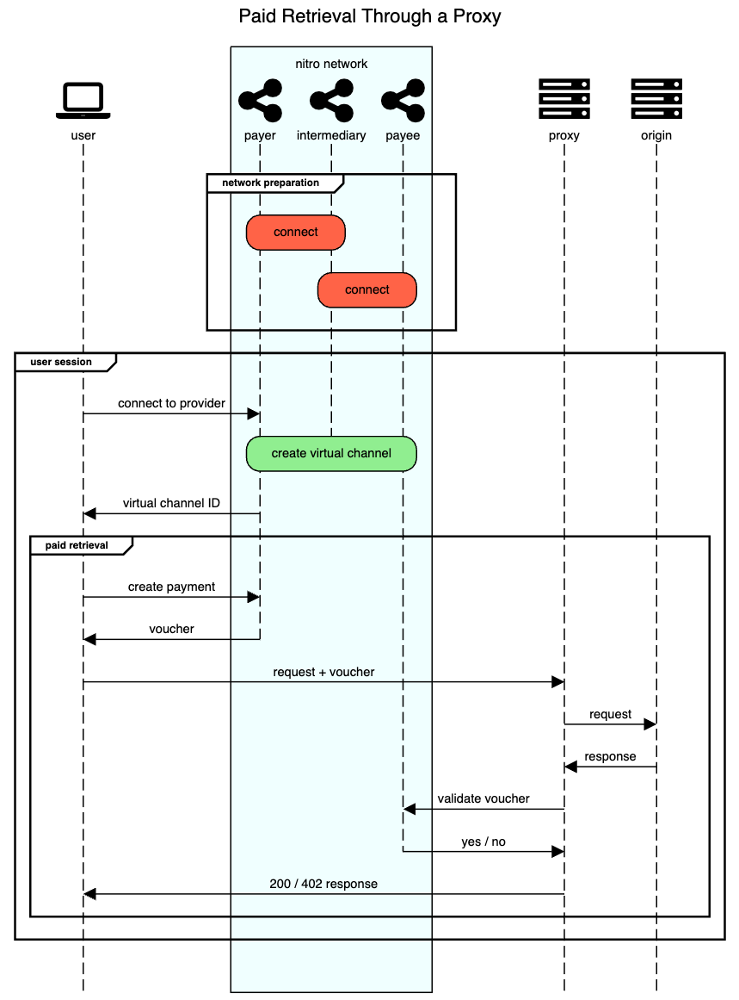

# Payment Proxy Client

This is basic client UI designed to work with a [reverse payment proxy](../../cmd/start-reverse-payment-proxy/). It provides some basic functionality to request a payload from the payment proxy and handles downloading the file or displaying the error(such as a 402- Payment Required).

It relies on a go-nitro rpc server network (which can be started using [this script](https://github.com/statechannels/go-nitro/blob/5b8c876d34638f9c322cf332bf758f5e9c284907/scripts/start-rpc-servers.go))



<!--
Edit this diagram at sequencediagram.org with the following source:

```
title Paid Retrieval Through a Proxy
fontawesome f109 user
participantgroup #azure nitro network
fontawesome f1e0 payer
fontawesome f1e0 intermediary
fontawesome f1e0 payee
end

fontawesome f233 proxy
fontawesome f233 origin
group network preparation
rbox over payer,intermediary#tomato:connect
rbox over payee,intermediary#tomato:connect

end
group user session
user->payer: connect to provider
rbox over payer,payee#lightgreen: create virtual channel
destroysilent intermediary
payer->user: virtual channel ID

group paid retrieval
user->payer: create payment
user<-payer: voucher
destroysilent payer
user->proxy: request + voucher
proxy->origin: request
proxy<-origin: response
proxy->payee: validate voucher
payee->proxy: yes / no
destroysilent payee
user<-proxy: 200 / 402 response
end
end
```
 -->
