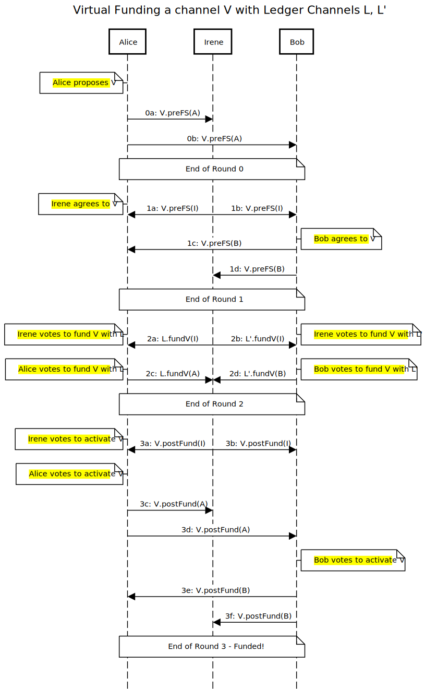

# Virtual fund off-chain protocol

## Single hop case

Take three actors Alice, Bob and Irene. Given a ledger channel `L` between Alice and Irene and a ledger channel `L'` between Bob and Irene, the clients send and wait on messages as shown in the below sequence diagram in order to create and fund a virtual channel `V`:

The diagram is generated at https://sequencediagram.org/. The source code for this diagram is co-located in this folder, and should be updated in concert with changing the diagram.

## Number of rounds

The number of rounds shown in this diagram is currently 4. The number of rounds can be reduced via a variety of optimizations, some of which are state below:

- Round 0 and round 1 can be combined into a single round if all parties already know they want to join the virtual channel (rather than one party proposing it to the others).

- If Bob's initial balance is zero, it is simple to dispense with Round 3 entirely. With more sophisticated state channel logic, round 1 and round 2 may also be combined.
