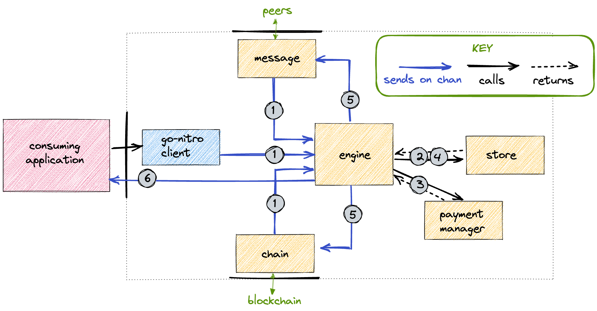

<h1 align="center">
<div><br>
go-nitro
</h1>
Implementation of nitro protocol in golang.

---

# Getting started

Please see [contributing.md](./contributing.md)

## Roadmap

The following roadmap gives an idea of the various packages that compose the `go-nitro` module, and their implementation status:

```bash
├── abi ✅                     # types for abi encoding and decoding.
├── channel ✅                 # query the latest supported state of a channel
│   ├── consensus_channel 🚧   # manage a running ledger channel.
│   └── state ✅               # generate and recover signatures on state updates
│       ├── outcome ✅         # define how funds are dispersed when a channel closes
├── client 🚧                  # exposes an API to the consuming application
│   └── engine 🚧              # coordinate the client components, runs the protocols
│       ├── chainservice 🚧    # watch the chain and submit transactions
│       ├── messageservice 🚧  # send and recieves messages from peers
│       └── store 🚧           # store keys, state updates and other critical data
├── client_test 🚧             # integration tests involving multiple clients
├── crypto  ✅                 # create Ethereum accounts, create & recover signatures
├── internal
│   ├── testactors ✅          # peers with vanity addresses (Alice, Bob, Irene, ... )
│   ├── testdata ✅            # literals and utility functions used by other test packages
│   ├── testhelpers ✅         # pretty-print test failures
|
├── protocols ✅               # functional core of the go-nitro client
│   ├── direct-fund ✅         # fund a channel on-chain
│   ├── direct-defund ✅       # defund a channel on-chain
│   ├── virtual-fund ✅        # fund a channel off-chain through one or more intermediaries
│   └── virtual-defund 🚧      # defund a channel off-chain through one or more intermediaries
└── types ✅                   # basic types and utility methods
```

Milestones that we hope to hit in the coming weeks:
| Integration Test | Engine components |Status |
| --------------------------------------|--- | --------|
| Directly Fund an (Alice, Bob) Channel | mock | ✅ |
| Virtually Fund an (Alice, Bob) Channel through a single Intermediary | mock | ✅ |
| Virtually Fund an (Alice, Bob) and an (Alice, Brian) Channel through a single Intermediary | mock | 🟡|
| Stream micropayments fron Alice to Bob | mock | |
| Directly Fund an (Alice, Bob) Channel | production | |

## Usage

Consuming applications should import the `client` package, and construct a `New()` client by passing in a chain service, a message service, and a store.

## Architecture in Brief

The `engine` listens for action-triggering events from:

- the consuming application / user via the go-nitro `client`
- the `chain` service (watching for on-chain updates to running channels)
- the `message` service (communicating with peers about the status of running or prospective channels)

and executes logic from the `protocols` package. Data required for the secure creation, running, and closing of channels lives in the `store`.

More detailed information can be found in each package's respective _readme_.


## On-chain code

`go-nitro` was originally developed "off-chain first". Alongside that development, we are now building out the on-chain component (solidity contracts): these are housed in the `nitro-protocol` directory. This directory contains an npm package with a hardhat / typechain / jest toolchain. This code originates from the nitro-protocol [npm package](https://www.npmjs.com/package/@statechannels/nitro-protocol), but is being modified / upgraded. The new version of the code is sometimes called nitro v2 or "satp".

Initially, these two development streams will remain independent, with each having its own continuous integration checks.

Over time, the development streams will become more coupled.

We now use `solc` and `abigen` to generate Go bindings from our `*.sol` source files. This is achieved by running the `generate_adjudicator_bindings.sh` script at the top level of the repo. Because our `*.sol` files depend on external projects via `node_modules`, to run this script successfully you must:

- have successfully run `npm install` in the `nitro-protocol` directory.
- have [solc](https://docs.soliditylang.org/en/v0.8.13/installing-solidity.html) installed at the correct version (currently 0.7.4, see the CI or linting config for a hint if you think it may have changed)
- have [abigen](https://geth.ethereum.org/docs/install-and-build/installing-geth) (a tool shipped with go-ethereum) installed.

The resulting Go bindings file is _checked-in_ to the repository. Although it is auto-generated from on-chain source code, it effectively forms part of the off-chain source code.

If you alter the contracts, you should regenerate the bindings file at check it in. A github action will run which will check that you have done this correctly.

## Contributing

See [contributing.md](./contributing.md)

## Architectural Decision Records

There is a [hidden folder](./.adr) in this directory containing architectural design records (ADRs).

## License

Dual-licensed under [MIT](https://opensource.org/licenses/MIT) + [Apache 2.0](http://www.apache.org/licenses/LICENSE-2.0)
